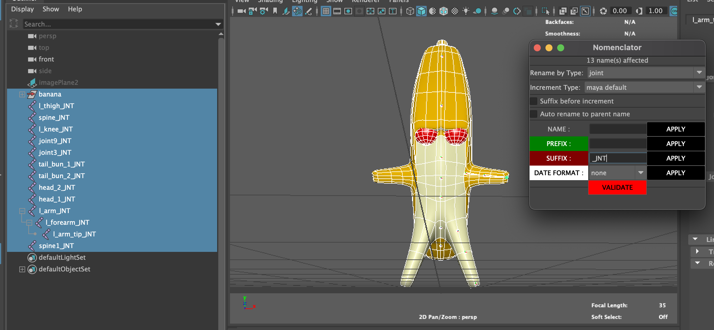

# Nomenclator

A simple script to facilitate the renaming of objects in a maya scene

## Features:

- renaming
- suffix addition
- prefix addition
- date addition
- different types of numbering when incrementing
- renaming by filtering
- adding a suffix before increment
- auto renaming feature using parent node name
